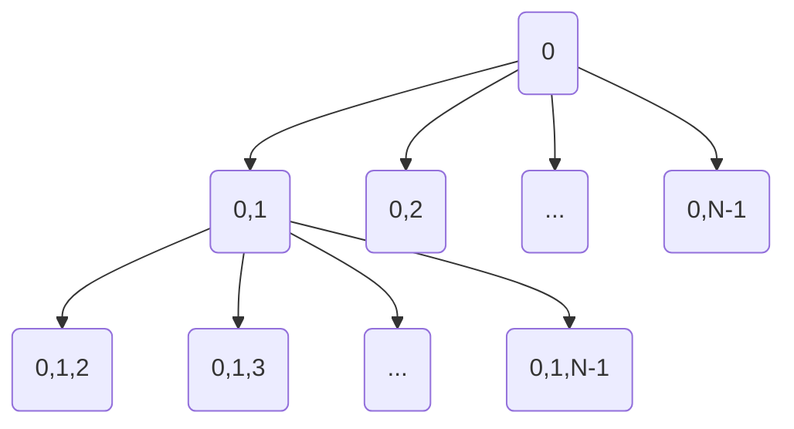

# O [[Problema do Caixeiro Viajante]]

Um vendedor deseja visitar as cidades $1, 2, \ldots, N-1$, partindo da sede de uma empresa na cidade $0$. O custo de viajar de uma cidade $i$ para uma cidade $j$ é $c_{ij}$, $i, j = 0, 1, \ldots, N-1$. O problema de determinar uma rota com o menor custo que visita todas as cidades exatamente uma vez é conhecido como [[Problema do Caixeiro Viajante]].

## Uma solução com enumeração explícita

Solução baseada na permutação da lista de cidades $(0, 1, 2, \ldots, N-1)$. É possível encontrar uma solução gerando todas as permutações da lista de cidades.



Por exemplo, se $N = 4$ basta avaliar todas as sequências $(N-1)! = 6$  sequências e escolher a de menor custo.
1.  $(0, 1, 2, 3)$	
2.  $(0, 1, 3, 2)$
3.  $(0, 2, 1, 3)$
4.  $(0, 2, 3, 1)$
5.  $(0, 3, 1, 2)$
6.  $(0, 3, 2, 1)$

A relação de recorrência para gerar as permutações de uma sequência $S = (0, 1, \ldots, N-1)$ de tamanho $N$ é dada por $$S_N = \bigcup_{i \notin S_{N-1}} \Big\{S_{N-1} | i \Big\}$$
 
### Implementação utilizando [[Backtracking]]

Pode-se realizar uma numeração explícita da todas as permutações da sequência $S = (0, 1, \ldots, N-1)$, computar o custo de cada uma delas, identificando, assim uma solução ótima. Para isso, pode-se utilizar o código a seguir.

```python
def backtrack(sol, left, N, best=INFINITY, opt=None):
    if left == N:
        cost = sol.get_value()
        if cost < best:
            best = cost
            opt = deepcopy(sol)
    else:
		for i in range(left, N):
			sol.tour[left], sol.tour[i] = sol.tour[i], sol.tour[left]           
			best, opt = backtrack(sol, left+1, N, best, opt)
			sol.tour[left], sol.tour[i] = sol.tour[i], sol.tour[left]
    return best, opt
```

A figura representa esquematicamente a execução do algoritmo.

![[Modelagem para programas lineares inteiros_ArvoreBacktrack.excalidraw]]

### Alguns testes

Foram gerados $N$ pontos aleatórios em uma área 100 x 100. O tempo computacional para se encontrar uma solução ótima do [[Problema do Caixeiro Viajante]] para esses pontos é apresentado na tabela a seguir, para diferentes valores de $N$.

| $N$   | Tempo (s) |
| --- | --------- |
| 5   | 0.001     |
| 6   | 0.003     |
| 7   | 0.006     |
| 8   | 0.030     |
| 9   | 0.213     |
| 10  | 1.999     |
| 11  | 21.636    |
| 12  | 312.102   |

```chart
	type: bar
	labels: [5, 6, 7, 8, 9, 10, 11, 12]
	series: 
	  - title: Tempo(s)
	    data: [0.001, 0.003, 0.006, 0.030, 0.213, 1.999, 21.636, 312.102]
```

### Análise do algoritmo

O algoritmo enumera todas as $(N-1)!$ soluções viáveis para o problema e compara o custo da solução atual com a melhor encontrada até o momento. Portanto, o tempo computacional do algoritmo é de complexidade $O(N!)$.

Melhorar as configurações de hardware ou utilizar uma linguagem como C/C++ poderia aumentar o tamanho dos problemas resolvidos no mesmo tempo computacional? #pergunta

#### Em um mundo mais rápido

Conforme o número de cidades $N$ aumenta, o número de soluções também aumenta

| $N$     | Tempo (s)            |
| ----- | -------------------- |
| $5$   | $24$                 |
| $10$  | $362880$             |
| $20$  | $1\,2 \cdot 10^{17}$ |
| $100$ | $\approx 10^{156}$   |

Considerando um computador que consiga avaliar (computar o custo) de uma solução em $10^{-34}s$, seriam necessários $$\approx 10^{122}s.$$ Mas a idade do universo é da ordem de $10^{17}s$ (e contando).

> A [Constante de Planck](https://en.wikipedia.org/wiki/Planck_constant) foi a menor constante física que eu consegui achar e tem valor da ordem de $10^{-34}$, expresso em unidades do Sistema Internacional.

Portanto, uma solução é investir em algoritmo que evitem enumerar todas as soluções explicitamente. 

## Uma enumeração ímplicita

Na verdade, não é necessário explorar todas as soluções explicitamente. Note que o algoritmo proposto adiciona uma cidade a cada chamada da função, ou seja, em qualquer chamada da função em que a condição $left == N$ não é verdadeira, existe uma solução parcial definida $p = (a_0, a_1, a_2, \ldots, a_i), i < N-1$. É possível calcular o custo de uma solução parcial $$c(p) = \sum_{j=0}^{i-1} c_{j, j+1}.$$ Se a solução parcial $p$ tiver um custo, $c(p)$, maior ou igual ao da melhor solução completa encontrada até o momento, não é necessário continuar explorando o ramo atual da árvore.  Por quê? #pergunta 

![[BacktrackingWithQualityPrune.excalidraw]]

Com essa modificação, há garantia de que uma solução ótima será encontrada? #pergunta 

Essa estratégia de poda da árvore é conhecida como poda por qualidade. 

### Implementação com poda por qualidade

```python
def backtrack(sol, left, N, best=INFINITY, opt=None):
    if left == N:
        cost = sol.get_value()
        if cost < best:
            best = cost
            opt = deepcopy(sol)
    else:
        cur_value = sol.get_value(0, left)
        if cur_value < best:
            for i in range(left, N):
                sol.tour[left], sol.tour[i] = sol.tour[i], sol.tour[left]           
                best, opt = backtrack(sol, left+1, N, best, opt)
                sol.tour[left], sol.tour[i] = sol.tour[i], sol.tour[left]
    return best, opt
```


Com a poda por qualidade baseada no custo das soluções parciais é possível resolver problemas de dimensões maiores em tempo computacional similar.

| $N$   | Tempo (s) |
| --- | --------- |
| 5   | 0.002     |
| 6   | 0.003     |
| 7   | 0.005     |
| 8   | 0.009     |
| 9   | 0.029     |
| 10  | 0.097     |
| 11  | 0.843     |
| 12  | 4.303     |
| 13  | 24.263    |
| 14  | 61.984    |
| 15  | 325.719   |


```chart
	type: bar
	labels: [5, 6, 7, 8, 9, 10, 11, 12, 13, 14, 15]
	series: 
	  - title: Tempo (s)
	    data: [0.001, 0.003, 0.006, 0.030, 0.213, 1.999, 21.636, 312.102]
	  - title: Tempo (s), UB
	    data: [0.002, 0.003, 0.005, 0.009, 0.029, 0.097, 0.843, 4.303, 24.263, 61.984, 325.719]
```


### [[Algoritmos de branch-and-bound]], utilizando um [[limitante inferior]]

É possível utilizar uma poda que inclui informações otimistas sobre o custo a ser atingido caso se continue explorando determinado ramo da árvore.  Uma opção é utilizar a [[Problema da Árvore Geradora Mínima|Árvore Geradora Mínima]] dos nós que ainda não foram visitados pela solução parcial atual. 

Note que o custo de uma [[Problema da Árvore Geradora Mínima|Árvore Geradora Mínima]] considerando os $N$ nós é um limitante inferior (otimista) para o custo de uma solução do [[Problema do Caixeiro Viajante]] com os mesmo $N$ nós. 

- Seja $t$ um tour no grafo $G$. A remoção de uma aresta de $G$ produz um caminho $r$. Como os custos das arestas são não negativos, tem-se $c(r) \leq c(t)$. Como um caminho é também uma árvore, tem-se que o custo da Árvore Geradora Mínima (MST) é tal que $$c(MST) \leq c(r) \leq c(t).$$

Isso possibilita que a operação de poda inclua informações sobre a solução de um [[Problema da Árvore Geradora Mínima]] para eliminar ramos da árvore que não forneçam soluções melhores do que a atual. 

> Seja $z$ o valor da melhor solução conhecida até o momento, $P = (a_0, a_1, \ldots, a_i), i < N,$ a solução parcial para o [[Problema do Caixeiro Viajante]] e $T$ uma [[Problema da Árvore Geradora Mínima|Árvore Geradora Mínima]] contemplando todos os nós não visitados na solução atual, $j \notin P$. Então,  se $c(P) + c(T) \geq z$ pode-se podar o ramo atual da árvore (não é necessário explorar a solução parcial $P$).  Por quê? #pergunta

Para utilizar o limitante baseado na [[Problema da Árvore Geradora Mínima|Árvore Geradora Mínima]] pode-se modificar a implementação como feito a seguir. 

```python
def backtrack(sol, left, N, best=INFINITY, opt=None):
    if left == N:
        cost = sol.get_value()
        if cost < best:
            best = cost
            opt = deepcopy(sol)
    else:
        cur_value = sol.get_value(0, left)
        bound_value = get_mst_cost(sol.tour[left+1:], sol.dist)
        if cur_value + bound_value < best:
            for i in range(left, N):
                sol.tour[left], sol.tour[i] = sol.tour[i], sol.tour[left]           
                best, opt = backtrack(sol, left+1, N, best, opt)
                sol.tour[left], sol.tour[i] = sol.tour[i], sol.tour[left]
    return best, opt
```

Com isso, executando algumas instâncias, obteve-se o seguinte resultado

| N   | Tempo (s) |
| --- | --------- |
| 5   | 0.005     |
| 6   | 0.007     |
| 7   | 0.014     |
| 8   | 0.021     |
| 9   | 0.047     |
| 10  | 0.095     |
| 11  | 0.436     |
| 12  | 0.854     |
| 13  | 2.339     |
| 14  | 4.523     |
| 15  | 6.849     |
| 16  | 13.905    |
| 17  | 24.966    |
| 18  | 31.602    |
| 19  | 34.846    |
| 20  | 121.833   |
| 21  | 238.015   |
| 22  | 367.061   |


```chart
	type: bar
	labels: [5, 6, 7, 8, 9, 10, 11, 12, 13, 14, 15, 16, 17, 18, 19, 20, 21, 22]
	series: 
	  - title: Tempo (s)
	    data: [0.001, 0.003, 0.006, 0.030, 0.213, 1.999, 21.636, 312.102]
	  - title: Tempo UB (s)
	    data: [0.002, 0.003, 0.005, 0.009, 0.029, 0.097, 0.843, 4.303, 24.263, 61.984, 325.719]
      - title: Tempo (s), UB e LB
	    data: [0.005, 0.007, 0.014, 0.021, 0.047, 0.095, 0.436, 0.854, 2.339, 4.523, 6.849, 13.905, 24.966, 31.602, 34.846, 121.833, 238.015, 367.061]
```


Quando se tem uma estratégia para conseguir um limitante otimista (inferior no caso de problemas de minimização e superior no caso de problemas de minimização), pode-se desenvolver um algoritmo de [[Algoritmos de branch-and-bound|Branch-and-bound]]. 

## Algumas conclusões

- Para resolver esse problema (e outros NP-difíceis) é necessário lidar com o crescimento exponencial do espaço de soluções. 
- O que fazer a cada novo problema encontrado?
	- Criar um algoritmo de enumeração explícita 
	- Encontrar propriedades que permitam a poda
		- Poda por qualidade
		- Poda por infactibilidade
	- Encontrar problemas auxiliares que forneçam bons limitantes inferiores
- Existe um arcabouço que já possui todas essas "funcionalidades". Inclusive com pacotes computacionais com toda a ideia de [[Algoritmos de branch-and-bound]] (e diversas outras) já implementada, sendo necessário, apenas, fornecer os dados de entrada. Para aprendermos a utilizar tais ferramentas, precisamos aprender [[Programação Linear Inteira Mista]].

# Programas Lineares Inteiros Mistos

$$\min c^Tx + h^Ty$$

sujeito a

$$Ax + Gy \leq b,$$
$$x \in \mathbb{Z}^n_+,$$
$$y^p \geq 0.$$

Onde os parâmetros são valores racionais:
- $c^T = (c_1, \ldots, c_n)$ ,
- $h^T = (h_1, \ldots, h_n)$,
- $A = (a_{ij})$ é uma matrix $m \times n$,
- $G = (g_{ij})$ é uma matrix $m \times p$,
- $b = (b_1, \ldots, b_m)^T$.

E as variáveis:
- $x = (x_1, \ldots, x_n)^T$, $n$ variáveis inteiras,
- $y = (y_1, \ldots, y_p)^T$, $p$ variáveis contínuas.

Para um problema de Programação Linear Inteira Mista, parâmetros são valores racionais determinísticos definidos antecipadamente. As variáveis representam decisões que podem ser tomadas. Cada atribuição de valores para as variáveis é chamado de **solução**. Uma solução pode ser:

> Solução viável (ou factível). Atende todas as restrições do problema.

> Solução inviável (ou infactível). Deixa de atender pelo menos uma restrição do problema.

## Um primeiro exemplo: O [[Problema da mochila]]

### O [[Problema da mochila]]

> No Problema da mochila, há uma mochila com capacidade $C$ e $n$ tipos de items, cada tipo item $i \in \{1, \ldots, n\}$ possui um peso e um valor $w_i$ e um valor, respectivamente. Qual é a quantidade de cada tipo de item que deve ser colocada na mochila de forma a maximizar o valore carregado, sem ultrapassar a capacidade da mochila?

Para elaborar um modelo é necessário definir quais são as variáveis do problema. Uma primeira tentativa é observar quais são as decisões a serem tomadas. Nesse caso, isso é suficiente para definir as variáveis:

- $x_i \in \mathbb{Z}⁺$: A quantidade de itens do tipo $i \in \{1, \ldots, n\}$ a serem carregadas na mochila. 

Para a construção do modelo é necessário escrever duas informações utilizando as variáveis e os parâmetros do problema: 
- O peso do conjunto de itens escolhidos.
	- Note que a expressão $w_1 x_1$ define o peso total dos itens de tipo $1$ escolhidos. Portanto
	- A expressão $w_1 x_1 + w_2x_2 + \ldots + w_nx_n$ compute o peso total dos itens escolhidos. A expressão pode ser escrita concisamente como $$\sum_{i=1}^nw_ix_i$$
- O valor do conjunto de itens escolhidos.
	- Com um racicínio análogo ao feito para o peso dos itens, tem-se: $$\sum_{i=1}^nv_ix_i$$

Com isso, a função objetivo do problema pode ser escrita como $$\max \sum_{i=1}^n v_ix_i$$ sujeito as restrições $$\sum_{i=1}^nw_ix_i \leq C,$$ $$x \in \mathbb{Z}^+.$$

Exemplos de implementações podem ser visto [[Problema da mochila#^091f1b]].

## Artifícios de modelagem

### Modelando relações lógicas com variáveis

Considere uma situação em que há um conjunto $S$ e a cada item do conjunto está associada uma variável binária $x_i, i \in S$. Semelhante ao [[Problema da mochila]]. Algumas situações frequentes em modelagem são exemplificadas a seguir.

#### No máximo $N$ elementos

Caso seja necessário que no máximo $N$ elementos do conjunto sejam selecionados:

$$\sum_{i \in S} x_i \leq N.$$

#### Pelo menos $N$ elementos

Caso seja necessário que no máximo $N$ elementos do conjunto sejam selecionados:

$$\sum_{i \in S} x_i \geq N.$$

#### Exatamente $N$ elementos

Caso seja necessário que exatamente $N$ elementos do conjunto sejam selecionados:

$$\sum_{i \in S} x_i = N.$$

Essa situação é análoga a um ou-exclusivo entre duas variáveis  $x_1 + x_2 = 1$

#### Se ... então... ($a \Rightarrow b$)

Considere duas variáveis binárias $x_a, x_b \in \{0, 1\}$ e que se deseja modelar a situação em que $x_a = 1 \Rightarrow x_b = 1$. Por exemplo, há situações em que a escolha de um item do conjunto implica na escolha de outro (do mesmo ou de outro conjunto). Isto é, se $x_a = 1$ então $x_b = 1$, $a, b \in S$.

$$x_a \leq x_b.$$

- Considerando $x_a, x_b \in \{0, 1\}$. Como modelar as seguintes situações? #pergunta 
	- $x_a = 0 \Rightarrow x_b = 0$
	- $x_a = 1 \Rightarrow x_b = 0$
	- $x_a = 0 \Rightarrow x_b = 1$
	- $x_a = 0 \Leftrightarrow x_b = 0$
	

Outra situação frequente é envolvendo uma variável binária $x_a \in \{0, 1\}$, um valor $L \geq 0$ e uma variável continua $y \geq 0$, tal que $$x_a = 1 \Rightarrow y \geq L.$$  Para modelar tal situação é possível utilizar a restrição $$L x_a \leq y.$$ Um raciocínio similar é utilizado no [[Problema de bin packing]].

#### Um exemplo

Uma empresa está considerando expandir suas operações para dois novos estados $A$ e $B$. Também, está considerando construir no máximo um novo depósito, mas a localização do depósito é restrita à localização da nova fábrica. O capital disponível é de 10 milhões. Os demais valores relacionados a tais escolhas é apresentado a seguir.

Para modelar o problema com o paradigma de Programação Inteira, considere as variáveis binárias  
$$x_j = \begin{cases}1\quad \mbox{se a decisão $j$ é sim},\\ 
0\quad \mbox{caso contrário},\end{cases}\quad (j = 1, 2, 3, 4).$$

| Decisão                    | Variável | Retorno previsto (R\$) | Investimento necessário (R\$)| 
| -------------------------- | ------------------- | ---------------- | ----------------------- |
| Construir fábrica em $A$?  | $x_1$             |     9 milhões             | 6 milhões                        |
| Construir fábrica em $B$?  | $x_2$         |     5 milhões             | 3 milhões                        |
| Construir depósito em $A$? | $x_3$         |   6 milhões               | 5 milhões                        |
| Construir depósito em $B$? | $x_4$     |    4 milhões              | 2 milhões                        |

- Seja $Z$ o retorno previsto por cada decisão. O retorno total em milhões de dólares.
	-	$$Z = 9x_1 + 5x_2 + 6x_3 + 4x_4.$$
- Como o capital disponível é de 10 milhões, uma restrição do modelo é 
	- $$6x_1 + 3x_2 + 5x_3 + 2x_4 \leq 10.$$
- No máximo um depósito será construído:
	- $$x_3 + x_4 \leq 1.$$
- Depósitos são só construídos se uma fábrica também for.
	- $$x_3 \leq x_1.$$
	- $$x_4 \leq x_2.$$

O modelo completo é dado por:

$$\max Z = 9x_1 + 5x_2 + 6x_3 + 4x_4$$
 
 sujeito a

$$6x_1 + 3x_2 + 5x_3 + 2x_4 \leq 10.$$
$$x_3 + x_4 \leq 1.$$
$$x_3 \leq x_1.$$
$$x_4 \leq x_2.$$
$$x_j \in \{0, 1\} \quad j = 1, 2, 3, 4$$


Este exemplo foi adaptado de [[2014Hillier_IntroductionToOperationsResearch|Hillier e Lieberman (2014)]].
O exemplo é um tipo de [[Problema de localização de facilidades]].


### Pelo menos uma restrição atendida

Considere duas restrições como as a seguir

$$\begin{cases}2x_1 + 3x_2 \leq 20,\\ 5x_1 + 2x_2 \leq 18.\end{cases}$$

Deseja-se que pelo menos uma dessas restrições seja atendida, mas não necessariamente ambas. 

Uma forma de realizar isso é utilizar uma variável auxiliar $y \in \{0, 1\}$.

$$y = \begin{cases}0, \mbox{ se $2x_1 + 3x_2 \leq 20$ é atendida } \\ 1, \mbox{ se $5x_1 + 2x_2 \leq 18$ é atendida } \\\end{cases}$$

Então, seja $M$ um número grande, podemos modelar a situação como:

$$\begin{cases}2x_1 + 3x_2 \leq 20 + My,\\ 5x_1 + 2x_2 \leq 18 + M(1 - y).\end{cases}$$

Essa técnica é útil, por exemplo, para modelos do [[Problema de corte e empacotamento]].

### $K$ de $T$ restrições atendidas

A ideia anterior pode ser adaptada para atender $K$ de um conjunto com $T$ restrições. Considere as $T$ restrições a seguir.

$$a_{11}x_{1} + \ldots + a_{1n}x_n \leq b_1,$$
$$a_{21}x_{1} + \ldots + a_{2n}x_n \leq b_2,$$
$$\vdots$$
$$a_{T1}x_{1} + \ldots + a_{Tn}x_n \leq b_T,$$

das quais é necessário atender pelo menos $K$. Para isso, seja $y_i \in \{0, 1\}, i=1, \ldots, T$, que recebe valor $0$ se a $i$-ésima restrição é atendida. 

Então, pode-se escrever

$$a_{11}x_{1} + \ldots + a_{1n}x_n \leq b_1 + My_1,$$
$$a_{21}x_{1} + \ldots + a_{2n}x_n \leq b_2 + My_2,$$
$$\vdots$$
$$a_{T1}x_{1} + \ldots + a_{Tn}x_n \leq b_M + My_2,$$
$$\sum_{i=1}^Ty_i = T - K$$


### Custo fixo

O custo fixo ocorre quando há um custo inicial para um atividade. Por exemplo, o setup de uma atividade e o início de uma corrida de aplicativo. 

Como exemplo, considere que foi feito um pedido para um aplicativo de transporte, o custo por quilômetro de viagem é de $c$, mas é pago um custo fixo, ao início da corrida de $k$. O objetivo é modelar a função de custo $f(x)$ em função da distância percorrida $x$.	

$$f(x) = \begin{cases}k + cx \mbox{ se $x > 0$,} \\ 0, \mbox{ caso contrário}\end{cases}$$

Para a construção do modelo, pode-se utilizar uma variável auxiliar $y \in \{0, 1\}$ que toma valor 1 se $x > 0$ e 0 caso contrário. 

Com isso, pode-se definir $$z = f(x, y) = ky + cx,$$ com a adição da restrição $$x \leq My,$$ onde $M$ é um valor grande.


## Aplicações

- De [[2020Wolsey_IntegerProgramming|Wolsey (2020)]]
	> *Scheduling* de trens. A agenda de alguns trens é periódica. Para cada linha, os tempos de viagem entre as estações é conhecido e o tempo de permanência em cada estação deve estar dentro de um intervalo. Dois trens viajando na mesma linha devem estar separados por um dado número de minutos. Para permitir a conexão de passageiros entre dois trens deve haver um intervalo entre a chegada do trem A e a partida do trem B. O problema é encontrar uma agenda factível para um conjunto de trens e linhas

	> Escalonamento de tripulação aérea

	> Planejamento de produção

	> Planejamento da geração de eletricidade

	> Telecomunicações

	> Tratamento de radio-terapia

	> Programas de transplante de rins

	> Problemas de corte

# Referências
- [[2020Wolsey_IntegerProgramming]]
- Palestra *Tuning a TSP Algorithm*. https://www.youtube.com/watch?v=SS5KfIFzfEE&list=FLQDy63aSs-IH4Zbniv8x4jA&index=4&t=4206s
- [[2014Hillier_IntroductionToOperationsResearch]]