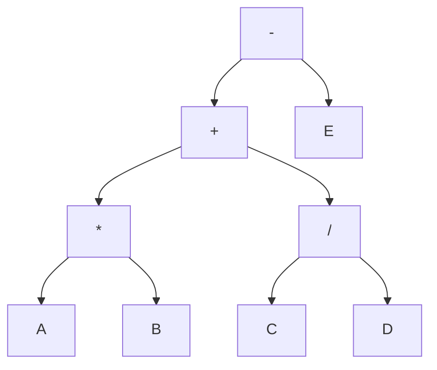
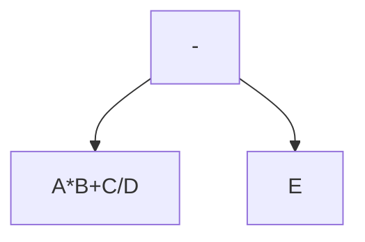
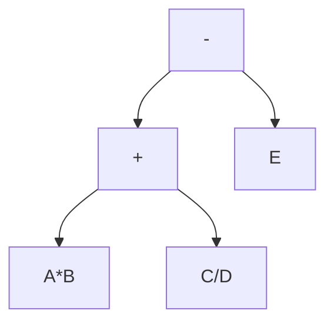
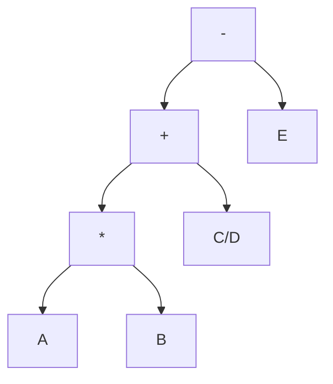

# Expressões aritméticas e árvores de expressão

Uma expressão aritmética pode ser representada utilizando diferentes notações. A notação com a qual estamos mais acostumados é a notação chamada de infixa. A expressão $$A*B + C/D - E$$ está escrita utilizando a notação infixa. 

No entanto, há outras notações que representam a mesma expressão aritmética. Na notação pós-fixa (ou posfixada), por exemplo, a expressão seria escrita da seguinte forma. $$AB*CD/+E-$$ Note que, para que o resultado seja o mesmo, o processamento da expressão deve considerar a notação em que ela está escrita.
Há ainda a notação pré-fixa (ou prefixada), que resultaria na expressão escrita como: $$-+*AB/CDE$$
## Árvores de expressão

Uma forma de converter entre os tipos de notação é representando uma expressão aritmética como uma árvore de expressão. Para isso, considere a expressão $$A*B+C/D-E$$ e a árvore binária a seguir.



Note que o percurso em-ordem (ou ordem simétrica), pós-ordem e pré-ordem na árvore de expresão produzem exatamente as expressões nas notações infixa, pós-fixa e pré-fixa respectivamente. Então, a construção da árvore de expressão permite a conversão entre os tipos de notação. 

### Construindo uma árvore de expressão

Para construir uma árvore de expressão, pode-se tomar uma expressão aritmética na notação infixa com ponto de partida. Por exemplo $$A*B+C/D -E.$$Essa expressão constitui o nó raiz da árvore inicial. Então, encontra-se o operador ($+, -, *$ ou $/$) de menor precedência que está mais à direita na expressão. Nesse caso, o operador de subtração. Com isso, o conteúdo do nó atual é substituído pelo operador e  a porção à esquerda e à direta do operador definem os filhos de esquerda e direita do nó atual, respectivamente. Por fim, repete-se o processo para o filho da esquerda e da direita do nó atual, até que os nós fiquem com apenas um símbolo (operador ou operando). Esse processo é ilustrado passo a passo a seguir. 

1. O sinal de subtração gera dois filhos. 


2. Repete-se o processo no filho da esquerda, ou seja, na expressão $A*B+C/D$, o operador de menor precedência é o de soma. Atualizando a árvore, tem-se:

3. Repete-se o processo no filho da esquerda ($A*B$), gerando a seguinte árvore

4. Repete-se o processo no filho da direita $(C/D)$: 


<div style="page-break-after: always;"></div>

# Uma implementação para a solução

```python
import queue

class Node:
    def __init__(self, _val=None, _left=None, _right=None):
        self.val = _val
        self.left = _left
        self.right = _right

def find_least_priority(string):
    i = len(string)
    if i == 0:
        return None
    i = i - 1
    last = None
    while i >= 0:
        c = string[i]
        if c == '+' or c == '-':
            return i
        elif last is None and (c == '*' or c == '/'):
                last = i
        i = i - 1
    return last    

def build_tree(root):
    sep = find_least_priority(root.val)
    if sep is not None:
        a, b, c = root.val[:sep], root.val[sep], root.val[sep+1:]
        print(a, " || ", b, " || ", c)
        root.val = b
        root.left = Node(a)
        root.right = Node(c)
        build_tree(root.left)
        build_tree(root.right)

def level_traversal(root):
    q = queue.Queue()
    q.put(root)
    while (q.empty() != True):
        item = q.get()
        print(item.val, end=" ")
        if item.left:
            q.put(item.left)
        if item.right:
            q.put(item.right)


def inorder(root):
    if root:
        inorder(root.left)
        print(root.val, end=" ")
        inorder(root.right)

def preorder(root):
    if root:
        print(root.val, end=" ")
        preorder(root.left)
        preorder(root.right)

def postorder(root):
    if root:
        postorder(root.left)
        postorder(root.right)
        print(root.val, end=" ")


test = "1*2+3*4*5-6+7*8"
root = Node(test)
build_tree(root)
print("Inorder:")
inorder(root)
print()
print("Preorder:")
preorder(root)
print()
print("Postorder:")
postorder(root)
print()
print("Level:")
level_traversal(root)
print()
```